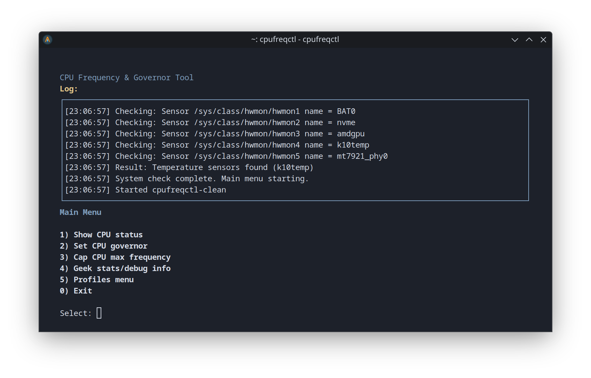
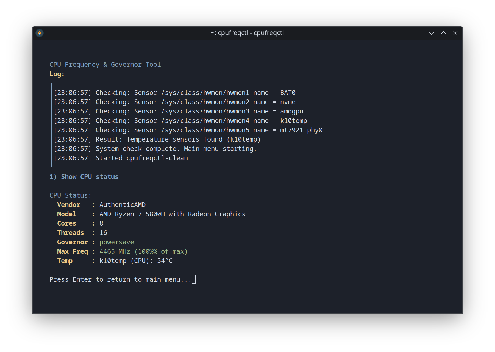
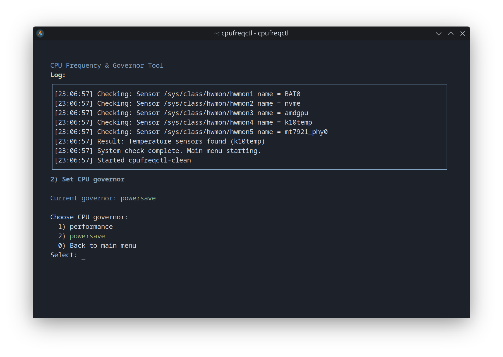
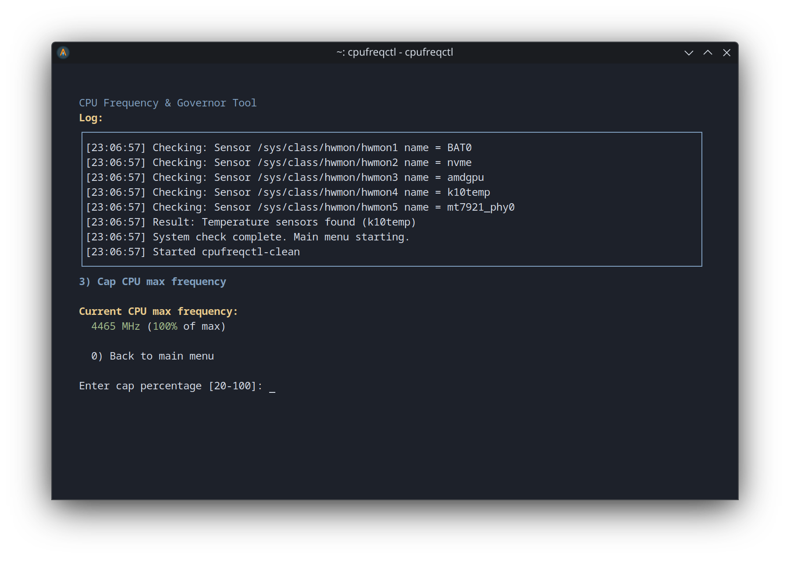

# cpufreqctl

cpufreqctl is an interactive, user-friendly CPU governor and frequency control tool for Linux systems using the kernel's `cpufreq` interface via sysfs. It lets you monitor and control CPU scaling, governors, and frequency caps from the terminal. The tool was developed on openSUSE but should work on most modern Linux distributions. Advanced details and sensor readouts are available for deeper analysis.

**Disclaimer:** Use at your own risk. While cpufreqctl does not make changes unless you explicitly confirm them, modifying CPU settings can impact system stability and performance. No guarantee is provided for compatibility or safety on all systems.

## Screenshots

### Main Menu


### CPU Status


### Governor Selection


### Set Cpu Cap


## Features

* View CPU details, scaling status, and temperature (auto-detected for most CPUs)
* Set the CPU governor (e.g. performance, powersave)
* Cap the maximum CPU frequency as a percentage (minimum enforced)
* Save, load, and manage named profiles (including a default profile)
* Restore your system's original settings (by applying the default profile)
* Advanced stats and sensor info for power users ("Geek menu")
* **Command-line interface (CLI) for scripting and automation**


## How does it work?

cpufreqctl interacts directly with Linux sysfs (`/sys/devices/system/cpu/cpufreq/...`) and standard tools like `awk`, `sudo`, and `bash`. It reads available governors, scaling frequencies, and sensor data from the kernel, making no assumptions about your hardware or distribution. Actions requiring changes (like setting a governor) use `sudo` for safety but the menu can be used as a normal user.


## Requirements

* Any modern shell (bash, zsh, fish, ksh, tcsh, dash, ash)
* Linux with kernel cpufreq/sysfs interface (most desktop/laptop distros)
* sudo (for system changes)
* awk
* Sensors (for temperature readout; works best with coretemp, k10temp, etc.)


## Installation

To install system-wide (recommended), run:

```shell
./install.sh
```

This will:
1. Copy `cpufreqctl.sh` to `/usr/local/bin/cpufreqctl` and make it executable
2. Detect your current shell and configure it appropriately
3. Add `/usr/local/bin` to your PATH if needed
4. Create necessary configuration files for future shell compatibility

The installation script will:
- Work with any supported shell (bash, zsh, fish, ksh, tcsh, dash, ash)
- Create a `.profile` file for system compatibility
- Configure your shell's startup files appropriately
- Verify the installation was successful

You can then run `cpufreqctl` from anywhere.

If you prefer not to install, you can run locally without installation:

```shell
./cpufreqctl.sh
```


## Usage

Just run:

```shell
cpufreqctl
```

This will launch the interactive menu UI.

### Interactive Menu Options

1. **Show CPU status**

   * Shows vendor, model, cores, threads, current governor, current frequency cap, and live CPU temperature.
2. **Set CPU governor**

   * Choose from available governors. Applies your choice to all CPU cores.
3. **Cap CPU max frequency**

   * Cap the max CPU speed as a percent of the hardware maximum (minimum allowed is 20%).
4. **Geek stats/debug info**

   * Shows all policy groups, governors, caps, and all temp sensors for deeper analysis.
5. **Profiles menu**

   * Save current settings as a named profile
   * Apply (load) a saved profile
   * Delete a profile
   * Save current settings as the default profile (with warning)
   * The default profile is always named `default` and can be restored at any time


## Command-Line Interface (CLI)

cpufreqctl can also be used non-interactively from the command line for scripting, automation, or quick status checks. All CLI options are script-friendly and produce plain output.

### CLI Usage

```shell
cpufreqctl [OPTIONS]
```

### CLI Options

**Profile management:**

- `-l`, `--list`                  List all saved profiles
- `-a`, `--apply <profile>`       Apply (load) a profile
- `-s`, `--save <profile>`        Save current settings as a profile
- `-d`, `--delete <profile>`      Delete a profile
- `--set-default <profile>`       Set a profile as the default (overwrites the 'default' profile file; prompts for confirmation unless `--force` is given)

**Status and info:**

- `-S`, `--status`                Show current CPU status
- `-G`, `--governors`             List available CPU governors

**Other:**

- `--cap <percent>`               Cap CPU max frequency to percent (20-100)
- `--set-governor <gov>`          Set CPU governor
- `-h`, `--help`                  Show this help message

**Examples:**

```shell
cpufreqctl --status
cpufreqctl --list
cpufreqctl --apply powersave
cpufreqctl --set-default performance
cpufreqctl --set-default performance --force
cpufreqctl --cap 60
cpufreqctl --set-governor performance
```


## Profile System

cpufreqctl uses a named profile system. Profiles are saved in `~/.cpufreqctl-profiles/` as simple text files. The profile named `default` is treated as your "restore point" for defaults. You can save, load, and delete any number of profiles.

- **Setting a default profile** overwrites the `default` profile file. This is a destructive operation and will prompt for confirmation.
- **Restoring defaults** means applying the `default` profile.
- The tool does not "flag" a profile as default; it simply copies the chosen profile to the file named `default`.


## Notes

* **You do not need to run the whole tool as root**, but you will be prompted for sudo when changing system settings.
* If you do not save a default profile before making changes, you cannot "restore factory settings"—you can only restore what you have saved as `default`.
* All actions affect every CPU core/policy by default. Advanced per-policy or per-core settings are shown only in the geek/debug stats.
* CPU temperature is auto-detected and will always prioritize the real CPU sensor (e.g. k10temp/coretemp), falling back to the first available temp sensor if needed.
* The CLI and interactive UI share all logic; you can use either mode as needed.


## License

MIT


## Author

* David Campbell

For suggestions, improvements, or issues, open a pull request or contact me.

